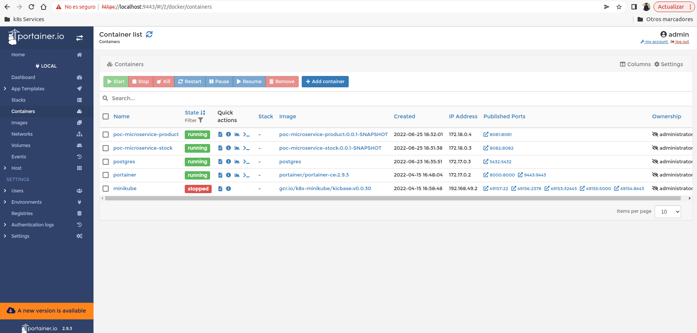

## Description
PoC Microservice Product

## Swagger UI

[Product Swagger UI](http://localhost:8081/api/swagger-ui/index.html)

## Build Docker image
```shell
docker build -t poc-microservice-product:0.0.1-SNAPSHOT .
```

## Run Docker image
Create network

```shell
docker network create microservice
```

Run image

```shell
docker run --rm --name poc-microservice-product -p 8081:8081 --network microservice poc-microservice-product:0.0.1-SNAPSHOT
```

